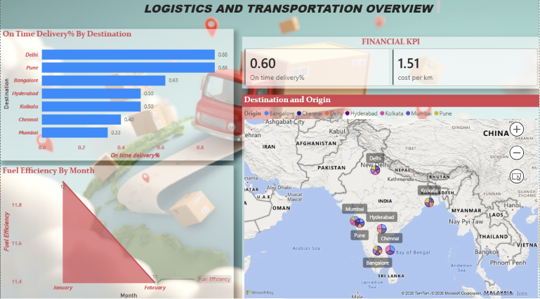

🚚 Logistics & Transportation Dashboard
📌 Project Overview

This project focuses on analyzing logistics and transportation operations using Microsoft Power BI. The goal is to transform raw shipment data into interactive dashboards that help monitor delivery performance, transportation efficiency, and operational metrics.

🎯 Objectives
Clean and prepare raw logistics data.
Analyze transportation and delivery performance.
Create interactive dashboards for business insights.
Practice real-world Business Intelligence (BI) and data visualization techniques.

🛠️ Tools Used
Microsoft Excel – Data Cleaning & Preparation
Microsoft Power BI – Data Modeling & Dashboard Development
Power Query – Data Transformation
DAX – Measures and Calculated Columns
ADDED COST OF FUEL IN THE CORRECSPONDING YEAR FOR CLEAR DATA VISUALIZATION.

The dataset contains 50 logistics trip records with key operational attributes, including:

Trip ID
Vehicle ID
Driver ID
Origin
Destination
Distance (km)
Fuel Consumed (L)
Delivery Status
Delivery Date

The data was cleaned and prepared before visualization in Power BI.

📈 Dashboard Features

The dashboard provides interactive visualizations for:

Fuel Consumption Analysis
Delivery Status Distribution
Route Performance
Date-based Delivery Trends
Interactive Filters and Slicers

🛠️ Tools & Technologies
Microsoft Power BI
Power Query
DAX (Data Analysis Expressions)

📌 Key Insights
Identified delivery completion trends over time.
Compared vehicle utilization and trip frequency.
Measured fuel efficiency across transportation routes.
Evaluated driver performance using operational KPIs.
Enabled data-driven decision-making through interactive reporting.

📂 Project Files
Logistics_Dashboard.pbix – Power BI Dashboard
logistics_project_dataset.xlsx – Source Dataset

🚀 Skills Demonstrated
Data Cleaning
Data Transformation
Data Modeling
DAX Measures
KPI Development
Dashboard Design
Logistics Analytics
Data Visualization

📷 Dashboard Preview

📫 Contact
Name - INDRAJITH P M

LinkedIn: www.linkedin.com/in/indrajith-p-m-a47a78218

